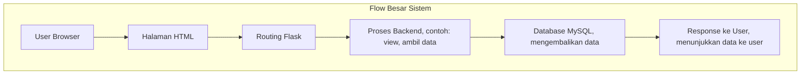
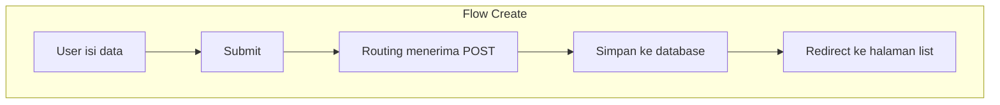
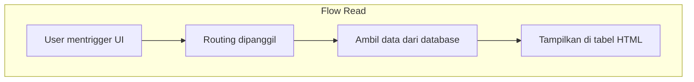
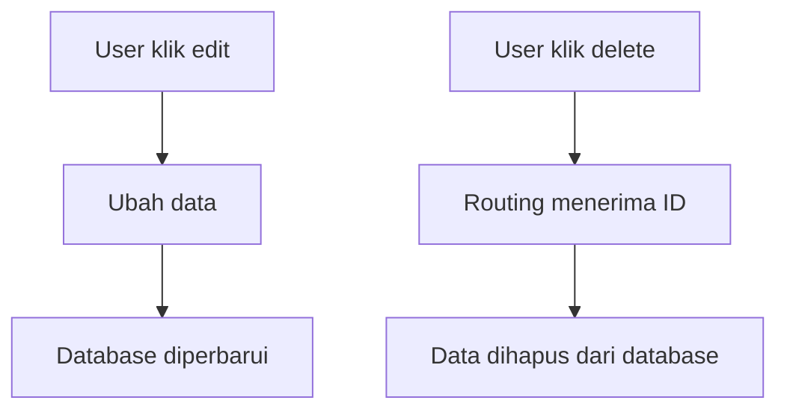
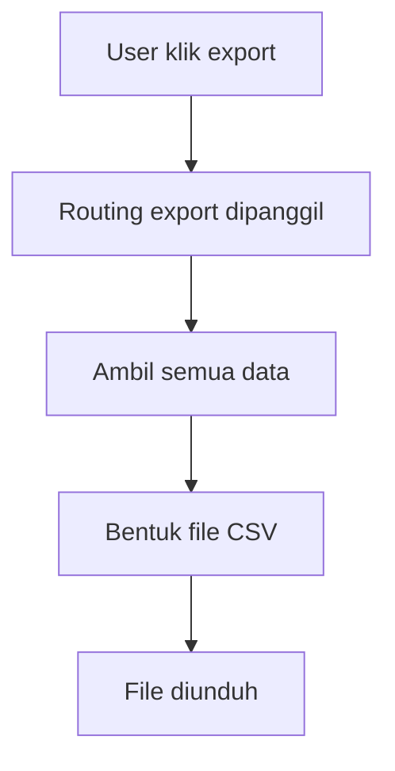
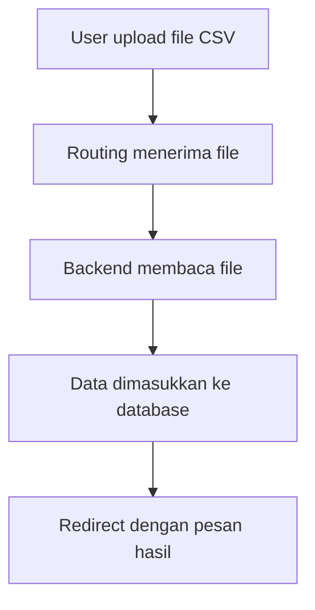
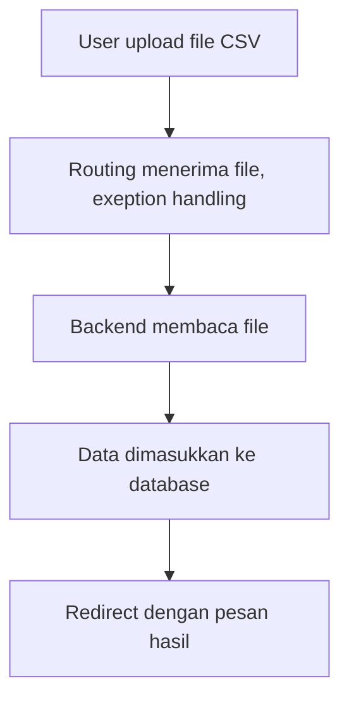

## Jelaskan secara singkat bagaimana request diproses dari user sampai kembali ke halaman.

---
# FLOW CRUD

---

---

---

---

## Jelaskan bahwa sistem harus menangani error agar tidak crash jika data tidak valid. (contoh import)

---

